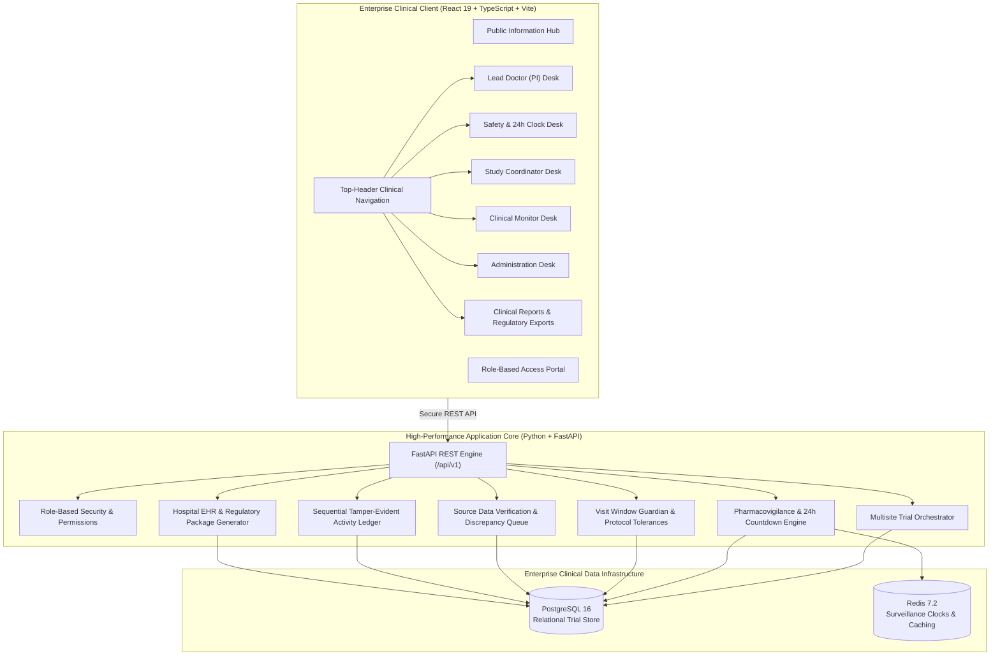

<div align="center">

# 🌿 AIIA Vault — Clinical Operations & Trial Intelligence Platform
### Multi-Centric Clinical Research Operations, Pharmacovigilance & Governance Suite for the All India Institute of Ayurveda (AIIA)

[](https://python.org)
[](https://fastapi.tiangolo.com)
[](https://react.dev)
[](https://www.typescriptlang.org)
[](https://www.postgresql.org)
[](https://redis.io)
[](https://docker.com)
[](https://cdsco.gov.in)

<p align="center">
  <strong>A cloud-native, enterprise-grade Clinical Trial Management System (CTMS) designed for rigorous Ayurvedic and integrative clinical research. Modeled after world-class life sciences platforms (Veeva Vault & Medidata) with zero technical clutter for investigators, hospital coordinators, and non-technical evaluators.</strong>
</p>

[Explore Key Features](#-key-capabilities) • [Live Role Portals](#-role-based-clinical-portals) • [Quick Start](#-quick-start-guide) • [Architecture](#-system-architecture) • [Regulatory Standards](#-regulatory-adherence--ethics)

---

</div>

## 📌 Executive Summary

Traditional Ayurvedic clinical trials encounter critical operational friction:
- **Disparate data collection**: Paper charts and fragmented spreadsheets lead to transcription errors and delayed discrepancy detection.
- **Strict safety reporting liabilities**: Statutory regulations (such as **CDSCO GCP Rule 12(3)**) require serious adverse event (SAE) reporting within **24 hours**, which manual workflows frequently breach.
- **Protocol non-adherence**: Missed visit windows (e.g., Day 28 ± 3 days) compromise statistical power and trial validity.
- **Regulatory auditing gaps**: Lack of an unalterable chronological audit trail exposes trials to data integrity scrutiny.

**AIIA Vault** solves these challenges by unifying **multisite hospital operations, 24-hour statutory safety surveillance, automated visit window enforcement, ALCOA+ tamper-evident chronological activity logs, and standardized medical reporting** into a unified, user-friendly clinical workspace.

---

## ✨ Key Capabilities

### 1. 🏥 Multisite Hospital Network Governance
- Real-time coordination across **8 premier Ayurvedic teaching and research hospitals** across India (AIIA New Delhi, BHU Varanasi, ITRA Jamnagar, NIA Jaipur, Haridwar, Thiruvananthapuram, Bengaluru, Mumbai).
- Real-time cohort recruitment velocity tracking against institutional targets (320 / 500 enrolled).
- Site-specific operational health indicators flagging query backlogs, visit deviations, and reporting lags.

### 2. ⏱️ 24-Hour Statutory Safety Clock (Pharmacovigilance Desk)
- Automated countdown timer initiated the instant a serious adverse event (SAE) is recorded.
- Visual urgency indicators and 1-click **CDSCO Form 44 Initial Notification Dispatch**.
- Medical causality assessment matrix differentiating study herb reactions from concurrent non-trial illnesses.

### 3. 🛡️ Visit Window Guardian & Protocol Tolerance Engine
- Automated verification of participant checkup dates against clinical protocol tolerances (e.g., **Day 28 ± 3 days**).
- Out-of-window visit flagging with mandatory doctor justification.
- Protocol amendment impact simulator projecting patient cohort impacts, re-consent requirements, and lab test additions before protocol updates.

### 4. 📝 Source Data Verification (SDV) & Discrepancy Queue
- Formal query resolution cycle linking hospital OPD paper charts to electronic case records.
- Side-by-side display of original recorded values, corrected values, coordinator rationales, and monitor sign-offs.
- Average discrepancy turnaround time tracking with audit-logged resolutions.

### 5. 📜 Permanent Tamper-Evident Medical Activity Ledger
- Consecutive, unalterable chronological audit logging conforming to **ALCOA+ principles** (Attributable, Legible, Contemporaneous, Original, Accurate + Complete, Consistent, Enduring, Available).
- Instant verification of historical sequence integrity with zero tolerance for retroactive tampering or deletions.

### 6. 📊 Official Clinical Reports & Hospital Records Compatibility
- Formatted, human-readable medical records explorer with tabbed views for:
  - **Demographics & Cohort** (`DM`)
  - **Vital Signs & Checkups** (`VS`)
  - **Adverse Health Reactions** (`AE`)
  - **Concomitant Medications** (`CM`)
  - **Study Herb Administration** (`EX`)
- 1-click export of official trial specification packages and CSV datasets ready for National Ethics Committees and Drug Licensing Authorities.

---

## 👥 Role-Based Clinical Portals

AIIA Vault provides tailored, high-productivity dashboards for each participant in the clinical research ecosystem:

| Clinical Role | Portal Path | Primary Responsibilities & Features |
| :--- | :--- | :--- |
| **Principal Investigator (Lead Doctor)** | `/app/pi-dashboard` | Multi-center recruitment progress, 1-click medical approvals, protocol deviation sign-offs, clinical milestone tracking. |
| **Pharmacovigilance Safety Officer** | `/app/safety-dashboard` | 24-hour statutory countdown clock, adverse event triage, medical causality evaluation, CDSCO Form 44 dispatch. |
| **Site Study Coordinator** | `/app/coordinator-dashboard` | Daily hospital OPD appointments, quick vitals entry (BP, pulse), upcoming visit window alert tracking. |
| **CRA Clinical Monitor** | `/app/monitor-dashboard` | Source Data Verification (SDV) tracking, open discrepancy queue, hospital site audit scores and query verification. |
| **Institutional Administrator** | `/app/admin-dashboard` | National trial portfolio oversight, participating hospital network governance, clinical ledger integrity confirmation. |

---

## 🏛️ System Architecture



---

## 🚀 Quick Start Guide

Follow these simple steps to run the complete AIIA Clinical Operations platform locally:

### 1. Prerequisites
- [Git](https://git-scm.com/) installed
- [Docker](https://www.docker.com/) and Docker Compose installed
- [Node.js](https://nodejs.org/) (v18 or higher)
- [Python](https://www.python.org/) (v3.10 or higher)

### 2. Clone the Repository
```bash
git clone https://github.com/Divyansh-109/AIIA-Clinical-Operations.git
cd AIIA-Clinical-Operations
```

### 3. Spin up PostgreSQL & Redis Infrastructure
```bash
docker compose up -d
```
> This starts PostgreSQL on port `5432` and Redis on port `6379`.

### 4. Setup and Run the Backend API
In a new terminal window:
```bash
cd backend

# Create and activate virtual environment
python -m venv .venv

# On Windows:
.venv\Scripts\activate
# On Linux/macOS:
source .venv/bin/activate

# Install dependencies
pip install -r requirements.txt

# Copy environment variables template
cp .env.example .env

# Start the FastAPI server
uvicorn app.main:app --host 127.0.0.1 --port 8000 --reload
```
> The backend will initialize database tables, seed the flagship **Phase III Ayush-PCOS Multi-Centric Trial**, and serve healthy at `http://127.0.0.1:8000/health`.

### 5. Setup and Run the Frontend Client
In another terminal window:
```bash
cd frontend

# Install dependencies
npm install

# Start Vite development server
npm run dev
```
> Open your browser and navigate to **`http://127.0.0.1:5173/`**.

---

## 🔑 Pre-Configured Demonstration Credentials

The platform includes seeded accounts allowing instant evaluation of each clinical role:

| Role | Email Address | Password | Clinical Function |
| :--- | :--- | :--- | :--- |
| **Principal Investigator** | `pi@aiia.gov.in` | `password123` | Trial Lead (Prof. Dr. Tanuja Manoj Nesari) |
| **Pharmacovigilance Officer** | `pv@aiia.gov.in` | `password123` | 24-Hour Safety Countdown Surveillance |
| **Study Coordinator** | `coordinator@aiia.gov.in` | `password123` | OPD Patient Visits & Daily Vitals |
| **CRA Clinical Monitor** | `cra@aiia.gov.in` | `password123` | Source Data Verification & Quality Audits |
| **Institutional Admin** | `admin@aiia.gov.in` | `password123` | Directorate of Research Administration |

*(A 1-click **Quick Switch Role** dropdown is also accessible in the top header once logged in).*

---

## 📁 Repository Directory Structure

```plaintext
AIIA-Clinical-Operations/
├── .gitignore                   # Ignores node_modules, .venv, build artifacts & secrets
├── README.md                    # System documentation and architecture guide
├── docker-compose.yml           # PostgreSQL 16 and Redis 7.2 container orchestration
│
├── backend/                     # Python / FastAPI Clinical Core
│   ├── .env.example             # Template environment variables
│   ├── requirements.txt         # Core backend dependencies
│   ├── pytest.ini               # Test suite configuration
│   ├── app/
│   │   ├── main.py              # Application entry point & lifespan handler
│   │   ├── core/                # Database engines, security, config settings
│   │   ├── models/              # SQLAlchemy models (Studies, Patients, Visits, SAEs, Audits)
│   │   ├── schemas/             # Pydantic schemas for request/response validation
│   │   ├── services/            # Business logic (Safety, Protocol, Quality, Audit, CDISC)
│   │   └── api/v1/              # REST API endpoint routers
│   ├── scripts/                 # Database seed scripts with Phase III clinical trial data
│   └── tests/                   # End-to-end operational and compliance test suites
│
├── frontend/                    # React 19 / TypeScript Clinical Client
│   ├── index.html               # Main HTML entry point with Jakarta Sans typography
│   ├── package.json             # Frontend dependencies & build scripts
│   ├── vite.config.ts           # Vite build pipeline & local proxy configuration
│   ├── public/                  # Clinical imagery, badges, and brand assets
│   └── src/
│       ├── index.css            # Veeva Vault / Medidata enterprise slate design system
│       ├── App.tsx              # Main routing and dynamic role dispatcher
│       ├── components/          # Top-header navigation, dropdowns, and layouts
│       ├── pages/               # 16 clean clinical operation pages (zero technical jargon)
│       └── services/            # Client API adapters
│
└── docs/                        # Event specifications, presentation decks, and notes
```

---

## ⚖️ Regulatory Adherence & Ethics

AIIA Vault is architected in accordance with statutory national and global clinical trial mandates:
- **CDSCO New Drugs and Clinical Trials Rules (2019)**: Enforces statutory 24-hour initial reporting and 14-day comprehensive causality dossier compilation.
- **Good Clinical Practice (GCP)**: Follows ICMR Ethical Guidelines for Biomedical and Health Research.
- **ALCOA+ Data Integrity Standard**: Attributable, Legible, Contemporaneous, Original, Accurate + Complete, Consistent, Enduring, Available.
- **Ayurvedic Standardization**: Incorporates **NAMASTE** morbidity codes and classical Ayurvedic pharmacopeia formulations (*Sahasrayogam Kwatha Prakarana*).

---

## 🤝 Contributing & Feedback

Contributions, suggestions, and issue reports are welcome. Feel free to open an issue or submit a pull request on GitHub:
👉 **[https://github.com/Divyansh-109/AIIA-Clinical-Operations](https://github.com/Divyansh-109/AIIA-Clinical-Operations)**

---

<div align="center">
  <sub>Developed for Smart India Hackathon (SIH 2026) · Problem Statement 46 · All India Institute of Ayurveda (AIIA)</sub>
</div>
