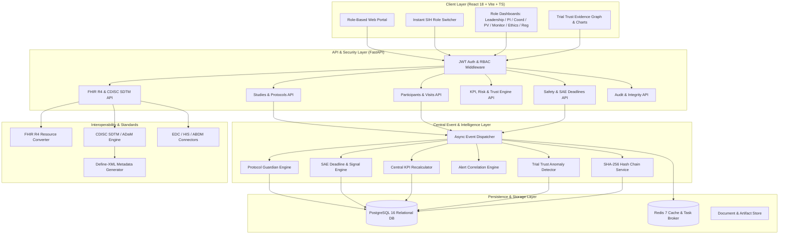

# System Architecture Specification
## AIIA Clinical Research Intelligence, Compliance & Trial Management Platform

---

## 1. High-Level System Architecture

The AIIA Platform is architected as an **Event-Driven Clinical Intelligence Hub** rather than a siloed set of CRUD modules. Every significant operational action emits a strongly-typed domain event that triggers downstream validations, KPI updates, risk score adjustments, alert evaluations, and tamper-evident audit logging.

---

## 2. Subsystem Descriptions

### 2.1 Identity, RBAC & Context Layer
- Enforces strict server-side authorization on all operations.
- Roles: `ADMIN`, `LEADERSHIP`, `PI`, `STUDY_COORDINATOR`, `MONITOR`, `ETHICS_COMMITTEE`, `PHARMACOVIGILANCE`, `REGULATOR`.
- Multi-tenancy / Study Scoping: PIs, Coordinators, and Monitors can only access studies/sites to which they are explicitly assigned. Regulators have read-only access. Leadership receives portfolio-wide aggregates with PII masked.

### 2.2 Core Study Operations & Lifecycle State Machine
- Manages study configuration, sites, and investigators.
- Strict state machine:
  $$\text{DRAFT} \to \text{PROTOCOL\_FINALIZED} \to \text{ETHICS\_PENDING} \to \text{ETHICS\_APPROVED} \to \text{CTRI\_REGISTERED} \to \text{SITE\_ACTIVATION} \to \text{RECRUITING} \to \text{ACTIVE} \to \text{FOLLOW\_UP} \to \text{CLOSE\_OUT} \to \text{COMPLETED}$$
- Every transition captures previous state, new state, user ID, timestamp, and justification.

### 2.3 Protocol Guardian (Intelligent Rule Engine)
- Translates unstructured protocol text into structured protocol rules:
  - Visit target day (e.g., Day 28)
  - Window offsets (e.g., Lower = $-3$ days, Upper = $+3$ days)
  - Mandatory assessments (Systolic/Diastolic BP, Weight, Lab Panels)
  - Prohibited / Restricted concomitant medications
- On visit submission, executes real-time validation:
  1. Computes Study Day: $\text{StudyDay} = \text{VisitDate} - \text{EnrollmentDate} + 1$.
  2. Evaluates Window: If $\text{StudyDay} < \text{Lower}$ or $\text{StudyDay} > \text{Upper}$, flags `OUT_OF_WINDOW`.
  3. Checks Required Assessments: Missing required values trigger an automatic `ProtocolDeviation` record.
  4. Generates outcome: `COMPLIANT`, `WARNING`, `DEVIATION`, or `CRITICAL_DEVIATION`.
- **Predictive Protocol Guardian**: Analyzes delay velocity across past visits. If a participant was late by $+4$ and $+6$ days on earlier visits and the next visit is due in 5 days, generates an upcoming deviation risk indicator.
- **Protocol Amendment Impact Analyzer**: Performs semantic diff between Protocol $v_A$ and $v_B$, identifying affected participant cohorts, future scheduled visits, and updated CRF fields.

### 2.4 Pharmacovigilance (PV) & Regulatory Deadline Engine
- Full AE, ADR, and SAE data capture with MedDRA/WHODrug abstraction.
- Automatic seriousness evaluation: Any affirmative answer to death, life-threatening, inpatient hospitalization, disability, or birth defect triggers an **SAE Escalation**.
- **Deadline Engine**:
  - Initial Regulatory Notification: Strict 24-hour deadline.
  - Comprehensive SAE Follow-up Report: Strict 7-day deadline.
  - Computes exact hours/minutes remaining, generating `URGENT` / `CRITICAL` alerts as deadlines approach.
- **Safety Signal Engine**:
  - Calculates proportional reporting ratios (PRR) and disproportionality metrics comparing observed vs expected event frequencies.
  - Prioritizes signals via a multi-factor score:
    $$\text{PriorityScore} = w_1 \cdot \text{Frequency} + w_2 \cdot \text{Severity} + w_3 \cdot \text{Trend} + w_4 \cdot \text{SiteConcentration}$$
  - Transparent evidence drill-down for every prioritized signal.

### 2.5 Trial Trust Engine & Integrity Evidence Graph
- Inspects operational data across all sites for data anomalies:
  - **Identical Measurements**: Detects unnatural clustering of identical physiological values (e.g., repeated blood pressure readings $120/80$ mmHg across different participants).
  - **Digit Preference / Benford's Law**: Flags artificial numbers lacking natural biological variance.
  - **Timestamp Burst Analysis**: Identifies bulk-entered visit data completed within seconds.
  - **AE Under-Reporting**: Flags sites where adverse event reporting is anomalously lower than peer sites with comparable enrollment.
- Constructs an interactive **Evidence Graph**:
  $$\text{Study} \longrightarrow \text{Site} \longrightarrow \text{Specific Anomaly} \longrightarrow \text{Exact Participant / Visit Records}$$

### 2.6 Tamper-Evident SHA-256 Audit Trail
- Each mutation generates an `AuditEvent` record.
- Linked via cryptographic hash chaining:
  $$H_0 = \text{SHA-256}(\text{"GENESIS"})$$
  $$H_n = \text{SHA-256}(Event_n.\text{id} \parallel Event_n.\text{timestamp} \parallel Event_n.\text{action} \parallel Event_n.\text{entity\_id} \parallel Event_n.\text{payload} \parallel H_{n-1})$$
- Audit verification routine recalculates the chain from genesis, providing verifiable mathematical proof that records have not been altered or deleted.

### 2.7 Interoperability (FHIR R4, CDISC SDTM & Define-XML)
- Canonical Clinical Model acts as the internal lingua franca.
- **FHIR R4 Mappings**:
  - `Participant` $\to$ `Patient`
  - `VisitAssessment` $\to$ `Observation`
  - `Medication` $\to$ `MedicationStatement`
  - `AdverseEvent` $\to$ `AdverseEvent`
  - `Consent` $\to$ `Consent`
  - `Study` $\to$ `ResearchStudy`
- **CDISC SDTM Exporter**:
  - Generates standardized CSV datasets for `DM` (Demographics), `VS` (Vital Signs), `AE` (Adverse Events), `CM` (Concomitant Medications), `EX` (Exposure).
  - Generates `Define-XML` compliant metadata describing domains, variables, labels, data types, and codelists.

---

## 3. Event-Driven Architecture & Event Catalog

Every key mutation publishes an event to the `EventBus`. Below is the complete catalog of primary events and their cascading reactions:

| Event Name | Source Action | Cascading Handlers |
| :--- | :--- | :--- |
| `ParticipantEnrolled` | Participant enrollment finalized | 1. Recalculate Recruitment KPIs 2. Update Site Performance 3. Recompute Enrollment Risk Index 4. Generate Audit Event |
| `VisitCompleted` | Visit data & assessments entered | 1. Execute Protocol Guardian validation 2. Validate clinical ranges & data quality 3. Check for out-of-window deviation 4. Recalculate Visit Compliance KPI 5. Trigger Trial Trust anomaly inspection 6. Generate Audit Event |
| `DeviationCreated` | Protocol deviation flagged | 1. Update Deviation KPIs 2. Route to PI & Monitor review queues 3. Update Site & Trial Risk scores 4. Generate Audit Event |
| `AECreated` | Adverse Event logged | 1. Evaluate Seriousness criteria 2. Map to MedDRA preferred term 3. Trigger Safety Signal Engine 4. Update Safety KPIs 5. Generate Audit Event |
| `SAEEscalated` | AE marked as Serious | 1. Launch 24h & 7d Countdown Timers 2. Dispatch urgent PV & PI notifications 3. Elevate Study Risk score 4. Trigger Leadership Dashboard alert 5. Generate Audit Event |
| `ProtocolAmended` | New protocol version approved | 1. Run Amendment Impact Analyzer 2. Identify affected participants & visits 3. Flag consent update requirements 4. Generate Audit Event |
| `QueryGenerated` | Data discrepancy detected | 1. Update Query KPIs (Open/Aging) 2. Assign to Study Coordinator 3. Generate Audit Event |

---

## 4. AI & Analytics Boundaries (Ethical & Regulatory Safeguards)

To preserve clinical integrity and comply with medical device/regulatory guidelines:
1. **Human-in-the-Loop Always**: AI outputs are strictly decision-support alerts, never autonomous actions.
2. **Transparent Nomenclature**:
   - $\checkmark$ *"Potential anomaly detected for review"*
   - $\checkmark$ *"Risk indicator elevated due to historical delay pattern"*
   - $\checkmark$ *"Prioritized safety signal requiring medical evaluation"*
   - $\times$ *Never claim "Confirmed fraud", "Guaranteed trial failure", or "Autonomous clinical diagnosis".*
3. **Traceable Evidence**: Every risk score or anomaly must explicitly present the underlying telemetry (e.g. "Site 4 flagged: 18 identical BP readings recorded between 10:00 and 10:15").
